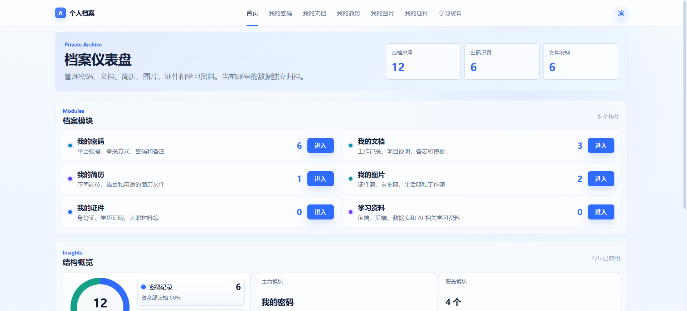
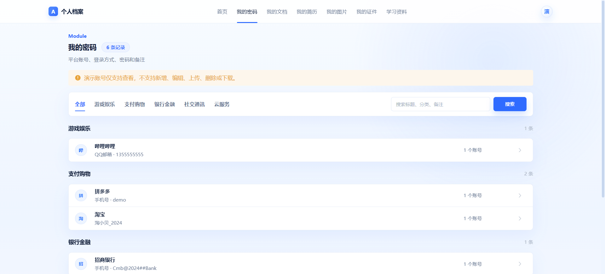
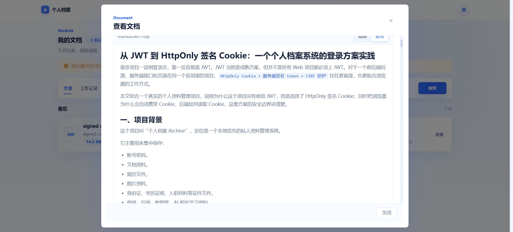
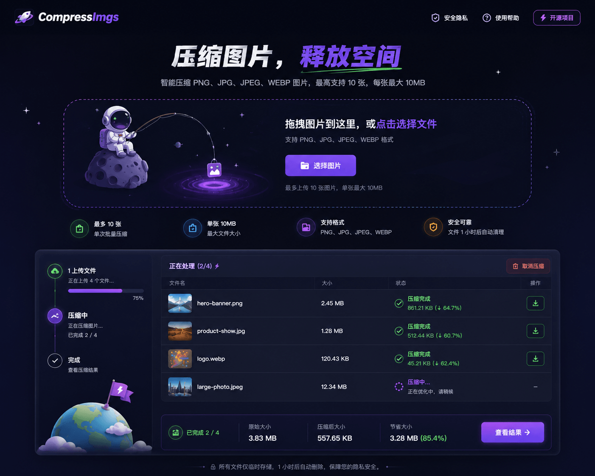
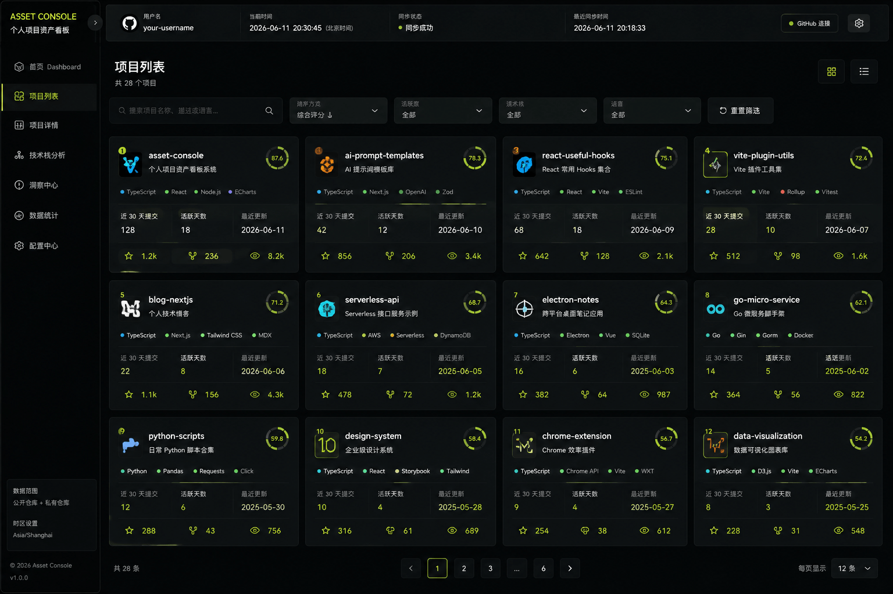
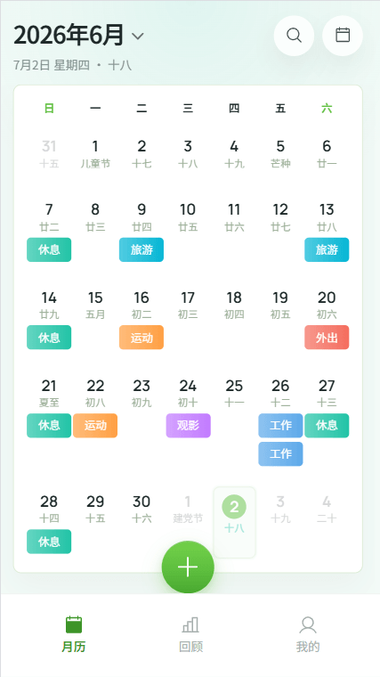
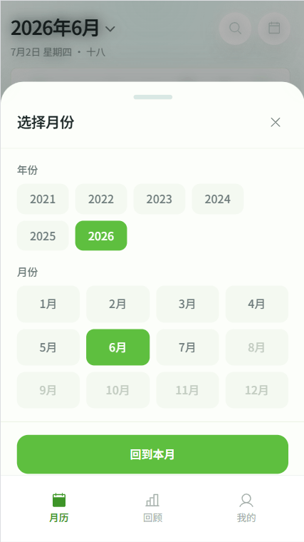
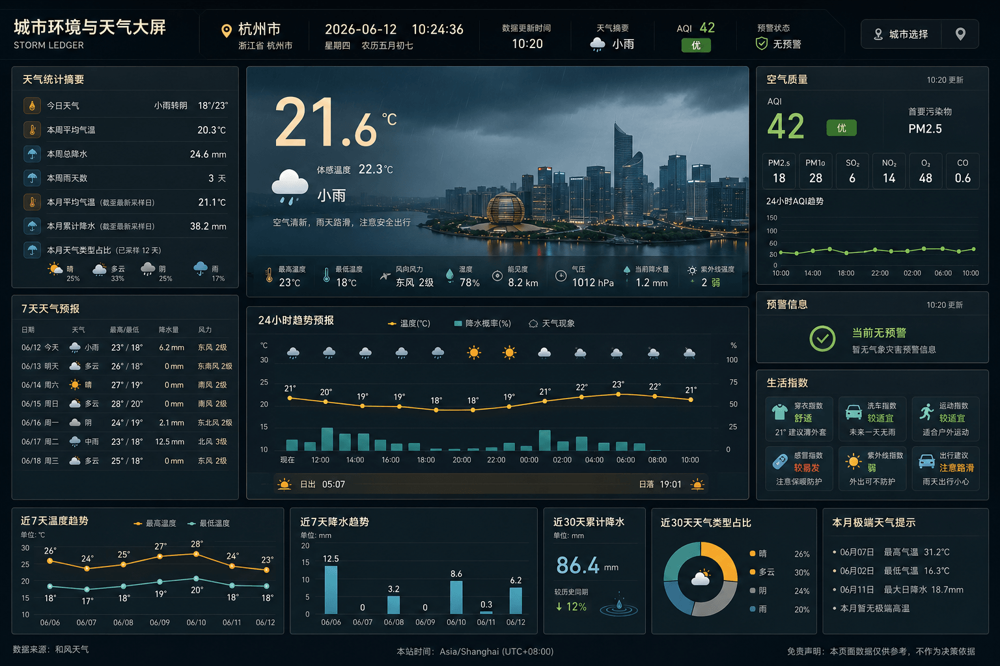
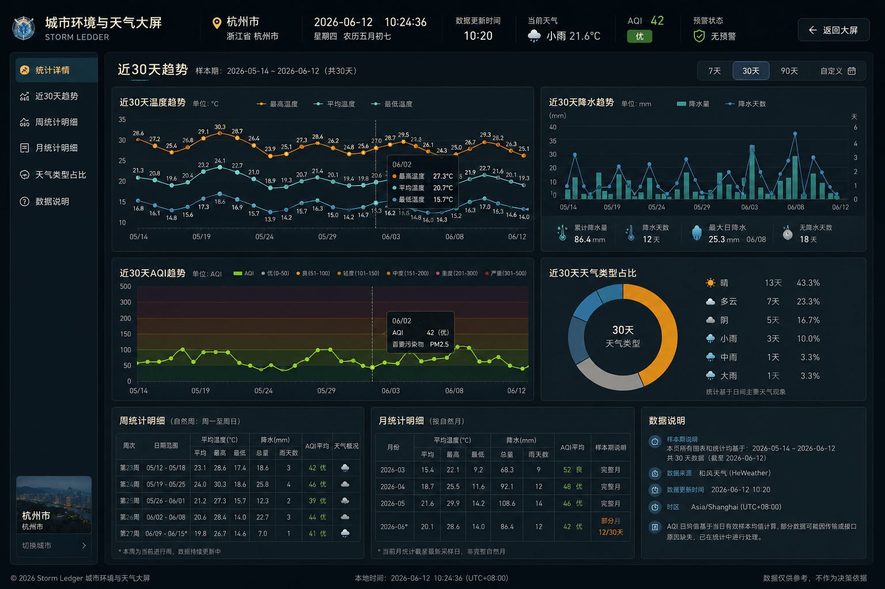

# mylab

> 个人项目展示站（Portfolio），集中展示与归档我维护的各类 Web 应用、平台与工具。

## 技术栈

- **框架**：Next.js 16（App Router）
- **前端**：React 19 + TypeScript
- **样式**：SCSS Modules + TailwindCSS（CSS Variables 双主题）
- **国际化**：zh / en 多语言
- **部署**：阿里云 ECS（Docker / PM2 / Nginx）

## 项目列表

### 1. blog — 我的技术博客系统


| 项目 | 说明 |
| --- | --- |
| 简述 | 我的技术博客系统 |
| 描述 | 从前端基础到框架实战，从编码提效到工程化部署，记录每个真实项目的踩坑、决策和复盘——不追热点，写自己验证过的东西 |
| 技术栈 | VitePress、Vue 3、TypeScript、Sass、TailwindCSS、Algolia 搜索 |
| 分类 / 标签 | 学习研究 · VitePress / Vue 3 / TypeScript |
| 状态 | 正常运行 |
| 链接 | [仓库](https://github.com/gouxinjie/gouxinjie.github.io) · [线上](http://gouxinjie.com) |

### 2. Prompt Gallery — 我的提示词案例库平台


| 项目 | 说明 |
| --- | --- |
| 简述 | 我的提示词案例库平台 |
| 描述 | 支持管理、展示和投稿 AI 图片生成提示词的完整平台。用户可按分类/风格/场景筛选、收藏、复制提示词、下载图片；管理员可发布、审核、维护标签与统计 |
| 技术栈 | Next.js 16、React 19、TypeScript、Supabase、SCSS Modules、Radix UI |
| 分类 / 标签 | 平台 · Next.js / React 19 / Supabase |
| 状态 | 正常运行 |
| 链接 | [仓库](https://github.com/gouxinjie/prompt-template-studio) · [线上](http://prompt.gouxinjie.com) |

### 3. archive — 我的个人档案管理系统


<details>
<summary>更多截图</summary>

  

</details>

| 项目 | 说明 |
| --- | --- |
| 简述 | 我的个人档案管理系统 |
| 描述 | 本地优先的私人资料管理系统，集中保存账号密码、文档、简历、图片、证件和学习资料，按用户账号隔离数据 |
| 技术栈 | Nuxt 4、Vue 3、TypeScript、SCSS、Element Plus、SQLite、better-sqlite3 |
| 分类 / 标签 | 应用 · Nuxt 4 / Vue 3 / SQLite |
| 状态 | 正常运行 |
| 链接 | [仓库](https://github.com/gouxinjie/archive) · [线上](http://archive.gouxinjie.com) |

### 4. compress-imgs — 我的个人在线图片压缩工具



| 项目 | 说明 |
| --- | --- |
| 简述 | 我的个人在线图片压缩工具 |
| 描述 | 类似 TinyPNG 的在线图片无损压缩工具，支持 PNG/JPG/WebP，拖拽上传、实时进度、单图与批量 ZIP 下载，优先 Tinify 云端压缩，无 Key 时回退本地 Pillow |
| 技术栈 | FastAPI、Jinja2、原生 JavaScript、CSS、Tinify、Pillow 双引擎压缩 |
| 分类 / 标签 | 工具 · FastAPI / Python / Pillow |
| 状态 | 正常运行 |
| 链接 | [仓库](https://github.com/gouxinjie/compress-imgs) · [线上](http://compress-imgs.gouxinjie.com) |

### 5. codeview — 我的个人 GitHub 数据可视化看板


<details>
<summary>更多截图</summary>

  

</details>

| 项目 | 说明 |
| --- | --- |
| 简述 | 我的个人 GitHub 数据可视化看板 |
| 描述 | 面向个人开发者的 GitHub 数据可视化产品，将仓库数据同步到本地 SQLite 沉淀为可视化面板：活跃度趋势、热力图、技术栈分析、四维评分、自动洞察 |
| 技术栈 | Node.js、Express、React、Vite、SQLite、ECharts、GitHub REST API 增量同步 |
| 分类 / 标签 | 数据可视化 · React / Express / ECharts |
| 状态 | 正常运行 |
| 链接 | [仓库](https://github.com/gouxinjie/codeview) · [线上](http://codeview.gouxinjie.com/) |

### 6. flow-calendar — 我的月历生活记录工具（H5）


<details>
<summary>更多截图</summary>

  

</details>

| 项目 | 说明 |
| --- | --- |
| 简述 | 我的月历生活记录工具（H5） |
| 描述 | 用来知道"之前做过什么"的记录与回顾工具——不做计划、不设 KPI，只是把已经发生过的生活清晰地留在月历上 |
| 技术栈 | Next.js、React 19、TypeScript、Prisma、SQLite、Tailwind CSS 4、SCSS |
| 分类 / 标签 | 其他 · Next.js / React 19 / Prisma |
| 状态 | 正常运行 |
| 链接 | [仓库](https://github.com/gouxinjie/flow-calendar) · [线上](http://flow-calendar.gouxinjie.com) |

### 7. weather-dashboard — 我的天气可视化大屏



<details>
<summary>更多截图</summary>



</details>

| 项目 | 说明 |
| --- | --- |
| 简述 | 我的天气可视化大屏 |
| 描述 | 用来"一眼看懂此刻城市天气"的聚合与展示工具——不做预测规划，只是把实时天气、空气质量、灾害预警、趋势与统计清晰留在同一屏上 |
| 技术栈 | React 18、Vite、TypeScript、ECharts、Node.js、Express、SQLite、Docker Compose |
| 分类 / 标签 | 数据可视化 · React / ECharts / Docker |
| 状态 | 正常运行 |
| 链接 | [仓库](https://github.com/gouxinjie/weather-dashboard) · [线上](http://weather.gouxinjie.com) |

## 本地开发

```bash
# 安装依赖（项目统一使用 pnpm）
pnpm install

# 启动开发服务器
pnpm dev

# 构建生产版本
pnpm build
```

## 目录结构

```
app/            页面与路由（Next.js App Router）
components/     组件（commons 公共组件 / business 业务组件）
lib/            数据、工具与配置（如项目数据集 projects.ts）
styles/         全局样式、变量与混入
public/         静态资源（含项目封面图 images/project-cover/）
```
