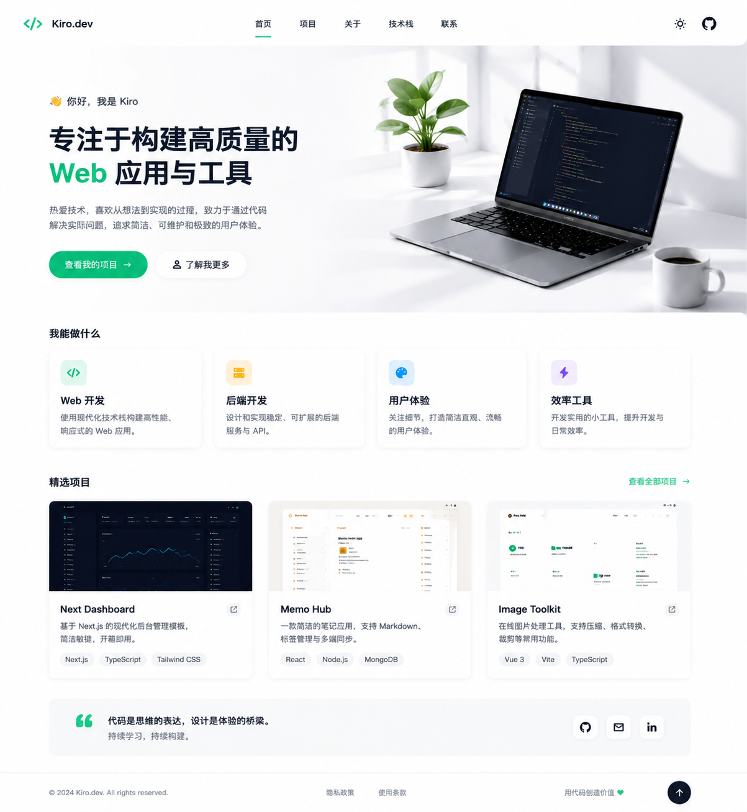
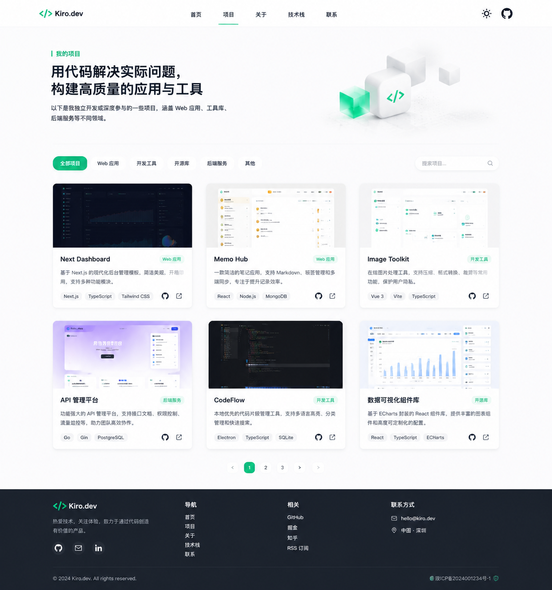
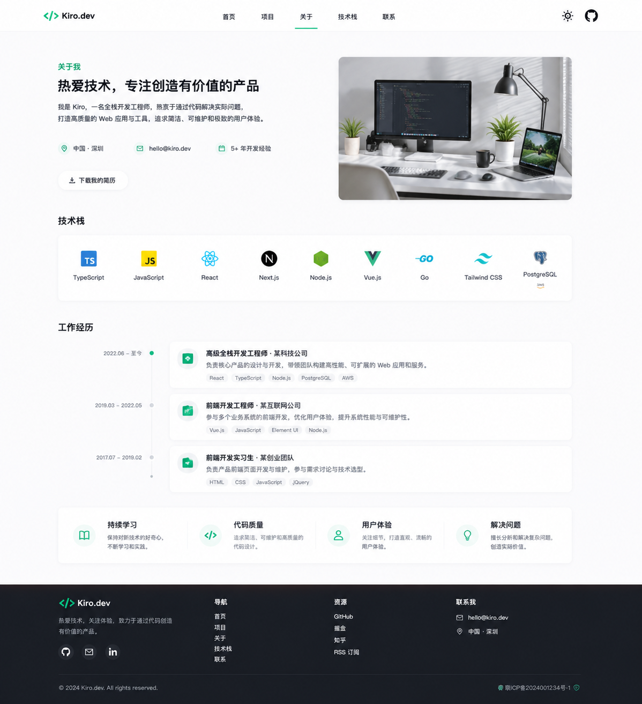

# mylab

> 我的个人项目展示站（Portfolio）。集中展示与归档我维护的各类 Web 应用、平台与工具，并支持中英文双语浏览。

## 站点预览

下面是本站点自身的界面截图。

### 首页



### 项目列表页



### 关于页



## 技术栈与部署

### 技术栈

- **框架**：Next.js 16（App Router）
- **前端**：React 19 + TypeScript
- **样式**：SCSS Modules + TailwindCSS（CSS Variables 双主题）
- **国际化**：next-intl 中/英多语言
- **内容渲染**：react-markdown + rehype + remark-gfm + mermaid（代码高亮与流程图）

### 部署信息

- **仓库地址**：https://github.com/gouxinjie/mylab
- **部署路径**：/var/www/mylab
- **镜像仓库**：ghcr.io/gouxinjie/mylab:latest
- **启动方式**：Docker Compose 双容器（app + nginx）→ 宿主 Nginx 反代到 127.0.0.1:3500，GitHub Actions 自动构建与部署
- **端口**：nginx 容器 80 → 宿主 3500，app 仅内网 3500，宿主 Nginx 对外 80
- **访问**：http://gouxinjie.com
- **CI/CD**：GitHub Actions（push master 触发 docker build → push ghcr.io → SCP 上传 → ECS docker compose pull + up -d）

## 收录项目

本站当前收录并展示以下 7 个项目：

| 项目 | 简述 | 链接 |
| --- | --- | --- |
| blog | 我的技术博客系统 | [仓库](https://github.com/gouxinjie/gouxinjie.github.io) · [线上](http://blog.gouxinjie.com/) |
| prompt | 我的提示词案例库平台 | [仓库](https://github.com/gouxinjie/prompt-template-studio) · [线上](http://prompt.gouxinjie.com) |
| archive | 我的个人档案管理系统 | [仓库](https://github.com/gouxinjie/archive) · [线上](http://archive.gouxinjie.com) |
| compress-imgs | 我的个人在线图片压缩工具 | [仓库](https://github.com/gouxinjie/compress-imgs) · [线上](http://compress-imgs.gouxinjie.com) |
| codeview | 我的个人 GitHub 数据可视化看板 | [仓库](https://github.com/gouxinjie/codeview) · [线上](http://codeview.gouxinjie.com/) |
| flow-calendar | 我的月历生活记录工具（H5） | [仓库](https://github.com/gouxinjie/flow-calendar) · [线上](http://flow-calendar.gouxinjie.com) |
| weather-dashboard | 我的天气可视化大屏 | [仓库](https://github.com/gouxinjie/weather-dashboard) · [线上](http://weather.gouxinjie.com) |

## 本地开发

```bash
# 安装依赖（项目统一使用 pnpm）
pnpm install

# 启动开发服务器
pnpm dev

# 构建生产版本
pnpm build
```

## 目录结构

```
app/            页面与路由（Next.js App Router）
components/     组件（commons 公共组件 / business 业务组件）
lib/            数据、工具与配置（如项目数据集 projects.ts）
styles/         全局样式、变量与混入
public/         静态资源（图标、背景、项目封面等）
imgs/           站点界面截图（首页 / 项目页 / 关于页）
```

## 开源协议

本项目基于 [MIT 协议](LICENSE) 开源，可自由使用、修改与分发。

