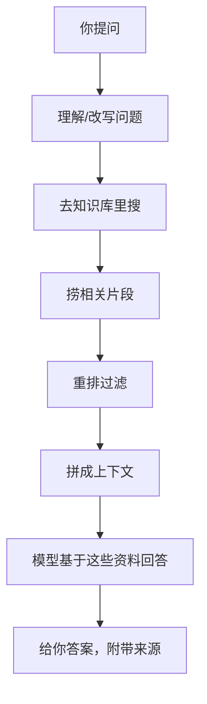
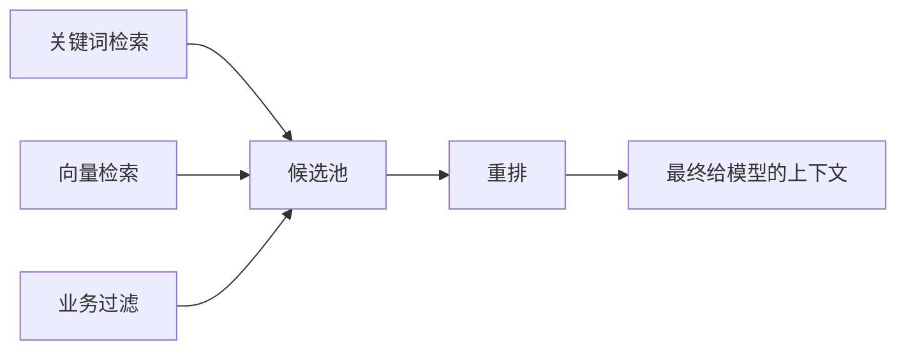

# 什么是RAG检索增强生成

你有没有问过 ChatGPT 一个关于你们公司的问题，然后它一本正经地编了一个不存在的制度？

我遇到过。那一刻我就知道，光靠模型自己"知道"的东西，很多场景根本不够用。

这就是 RAG 要解决的问题。

RAG 全称 Retrieval-Augmented Generation，翻译过来就是**检索增强生成**。听着唬人，其实思路特别简单：模型回答之前，先让它去翻一下你给的资料，带着资料再回答。

不是重新训练模型，也不是把一万页文档硬塞进 prompt，而是在问答中间插一个"先查后说"的步骤。

## 为什么光靠大模型不行？

大模型确实强，但落实到实际业务里，有三个挺要命的问题：

1. **你的数据它没见过**：公司制度、项目文档、接口定义、客户沟通记录——这些信息从来不在训练数据里。
2. **知识会过期**：模型训练完之后的事它一概不知，你的制度改了它也不知道。
3. **没依据的时候它硬编**：这就是幻觉（hallucination）。问它一个它不知道的事情，它不会说不知道，而是给你编一个看起来特别像真的答案。

RAG 就是把回答拴在真实资料上，让它没法瞎编。

## 流程到底怎么跑的？

不复杂，就这七步：



一句话概括就是：

```text
提问 → 找资料 → 带资料问模型 → 出答案
```

## 一个真实场景

假设你给公司搭了个 AI 助手，同事问：

```text
高铁一等座能报销吗？
```

**没 RAG 的时候**：模型只能猜。它可能说"大部分公司可以"，也可能编出一个报销流程，但跟你公司实际制度没半毛钱关系。

**有 RAG 的时候**：系统先去翻你们的《差旅报销制度.md》《财务审批规则.pdf》，找到相关段落，然后交给模型：

```text
请只基于以下制度原文回答用户问题。
如果制度里没明确写，请直接说"当前资料未提及"，不要自己推断。
```

这样出来的答案：
- 有明确结论
- 带原文引用
- 不确定的地方单独标出来
- 告诉你接下来该问谁

这才是企业里真正能用的 AI。

## RAG 里面都有啥？

一个完整的 RAG 系统拆开来大概长这样：

| 环节 | 干嘛的 | 容易翻车的地方 |
| --- | --- | --- |
| 文档采集 | 把 PDF、网页、数据库的东西收进来 | 数据源不全 |
| 文档清洗 | 去掉页眉页脚、格式乱码这些脏东西 | 标题层级、表格给洗没了 |
| 文档切片 | 把长文档切成一段一段方便检索 | 切太碎了没上下文，切太大了搜不准 |
| Embedding | 把文字转成向量（数值化表示） | 语义理解不到位 |
| 向量数据库 | 存向量和元数据 | 检索慢了用户等不了 |
| 召回 | 从库里找可能相关的片段 | 漏掉了真正有用的 |
| 重排 | 从候选里挑真正最相关的 | 排在前面的其实不相关 |
| 生成 | 基于资料让模型回答 | 没引用来源，还是编的 |
| 评估 | 检查回答质量能不能用 | 不做评估就不知道改了到底有没有变好 |

别被这表吓到，你刚开始做 MVP 的时候其实只用到前三列就够了，后面是优化的事了。

## RAG 和微调（Fine-tuning）到底怎么选？

这是被问得最多的问题。

| | RAG | 微调 |
| --- | --- | --- |
| 适合干嘛 | 查资料、问文档、知识经常变 | 学会特定风格、格式、任务习惯 |
| 更新数据 | 改知识库就行 | 一般得重新训 |
| 能追溯吗 | 能，答案可以标出原文来源 | 难，说不清为什么这么答 |
| 成本 | 工程搭建麻烦但更新灵活 | 训练烧钱 |
| 典型用法 | 企业知识库、客服、合同问答 | 分类器、风格迁移、特定的输出格式 |

一个粗暴的判断方法：**你需要的是一双"能查资料的眼睛"，还是"学会某种做事方式的手"？前者用 RAG，后者再考虑微调。**

大部分实际落地的场景，RAG 就够用了。

## 做 RAG 最容易踩的坑

### 切片切蹦了

这是最常见的翻车点。

- 切太大（比如一章一章的）：搜出来的东西太泛，模型找不到精确答案。
- 切太小（比如一句一句的）：搜到的是孤立的句子，前后因果关系全丢了。

实际经验：
- 技术文档按标题层级切
- FAQ 按问答对切
- 制度文档按条款切
- 不管怎么切，前后留一点重叠，别让上下文断掉

### 只靠向量检索

向量检索擅长找"意思差不多"的内容，但找精确的东西不一定稳：

- 产品型号 HX-850 和 HX-580，向量可能觉得差不多
- 订单号、工号、版本号，这些更适合直接用关键词匹配

所以实际系统一般是混合检索：



### 忘了权限

别把全公司的文档倒进一个池子，谁都能查。每个文档片段该带上部门、项目、权限级别这些标签，检索的时候该过滤就过滤。不然 HR 的数据被研发同事搜到了就尴尬了。

### 不做评估集

很多人搭完 RAG 跑了一下觉得"还行"就上线了。过两周用户反馈说"怎么搜不到"的时候，你完全不知道改切片大小还是换 Embedding 模型。

提前准备四类测试题：
- 经常被问的真实问题
- 容易搞混的问题（比如两个相似的制度条款）
- 资料里根本没有答案的问题（测它会不会瞎编）
- 跨部门权限的问题（测能不能拦住）

## 哪些场景值得搞 RAG？

- 企业制度问答（报销、请假、绩效这些）
- 产品文档助手（API 文档、使用手册）
- 内部研发知识库（架构设计、历史决策、on-call 手册）
- 客服辅助回复（查历史工单、产品知识）
- 合同条款检索（法务、采购最需要）
- 代码仓库问答（"这个接口谁写的，干什么用的"）
- 售前资料检索（方案、案例、报价）

这些场景有一个共同点：**答案必须来自资料，不能让模型拍脑袋。**

---

*延伸阅读*

- [LangChain：Build a RAG agent](https://docs.langchain.com/oss/python/langchain/rag)
- [LlamaIndex：Introduction to RAG](https://developers.llamaindex.ai/python/framework/understanding/rag/)
- [OpenAI：File Search](https://developers.openai.com/api/docs/guides/tools-file-search)
- [OpenAI Cookbook：Evaluate RAG with LlamaIndex](https://developers.openai.com/cookbook/examples/evaluation/evaluate_rag_with_llamaindex)

---

> RAG 说白了就是让大模型从"凭记忆瞎猜"变成"翻完资料再说话"。
