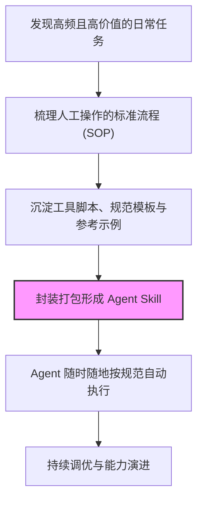
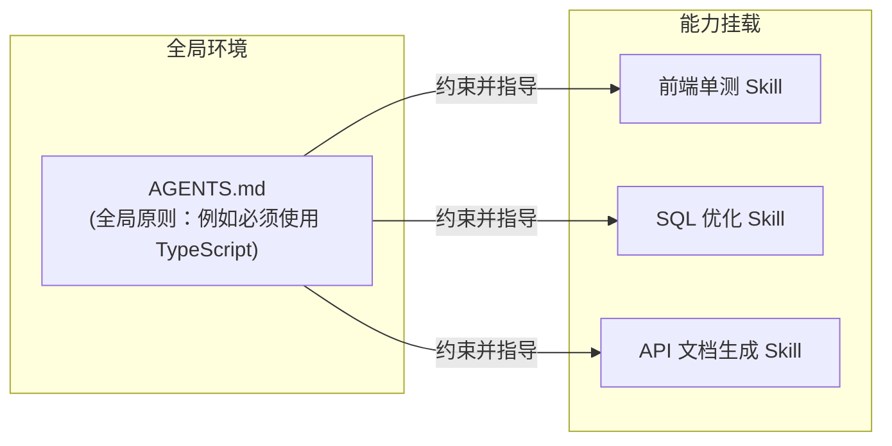

# Agent Skills：沉淀 AI 智能体的“可复用能力资产”

在 AI Agent（智能体）的日常应用中，我们常常会遇到这样的痛点：虽然大模型能力强大，但每次让它执行特定任务（如代码评审、周报生成、数据分析）时，都需要反复提供长篇大论的 Prompt（提示词），不仅交互成本高，而且输出结果的稳定性极差。

**Agent Skills** 就是为了解决这一问题而诞生的概念。它可以被理解为给 AI Agent 装备的 **“可复用能力包” **或**“标准作业程序（SOP）”** 。它将特定任务的上下文、执行流程、约束条件、工具脚本和示例文件打包封装，让 Agent 在遇到匹配场景时，能够以工业级的稳定性自动执行。

> 💡 **核心认知：**
> Prompt 是一次性的自然语言交互；而 Skill 是工程化的、可复用的能力资产。

## 一、为什么我们需要 Skills？（从“单次对话”到“能力固化”）

仅靠零散的提示词驱动 AI，就像每次都雇佣一个能力很强但没有记忆的新手。你需要不断重复团队规范、输出格式和操作步骤。

Skill 的核心价值在于**降低沟通成本**和**保障执行一致性**。当你将高频任务封装为 Skill 后：

1. **零成本唤醒**：只需一句指令，Agent 就能调取完整的背景知识和执行步骤。
2. **结果高度稳定**：通过内置的 Few-shot（少样本提示）和明确约束，大幅减少大模型的“幻觉”和自由发挥。
3. **沉淀团队最佳实践**：将团队优秀的经验（如资深工程师的 Code Review 标准）固化为代码或配置，赋能给所有人。



## 二、一个完整的 Skill 包含哪些要素？

工业级的 Skill 不仅仅是一段长文本，它通常是一个结构化的能力集合。一个优秀的 Skill 往往包含以下核心模块：

| 要素模块 | 核心作用 | 案例说明（以“代码评审 Skill”为例） |
| :--- | :--- | :--- |
| **Trigger（触发条件）** | 明确在什么场景下激活该能力 | “当用户请求 Review 代码、或者提到 PR/MR 时” |
| **Workflow（标准工作流）** | 规定 Agent 解决问题的具体步骤 | “1. 分析变更意图 → 2. 检查安全漏洞 → 3. 校验命名规范 → 4. 输出审查报告” |
| **Context & Input（输入规范）** | 明确需要用户提供哪些前置信息 | 目标分支、变更的 diff 文件、对应的 Issue 链接 |
| **Output Format（输出格式）** | 约束最终交付物的形态 | Markdown 表格、JSON 结构，或直接在代码中添加行级注释 |
| **Constraints（红线与约束）** | 明确什么事情**绝对不能做** | “不要对无关格式的代码进行吹毛求疵、不要擅自提交代码” |
| **Tools / Scripts（外挂工具）** | 赋予 Agent 突破文本处理的能力 | 静态代码分析脚本、Linter 校验工具、AST 解析器 |
| **Examples（参考示例）** | 通过 Few-shot 让 Agent 精准模仿 | 提供一份满分级别的 Code Review 意见样例 |

## 三、Skill 与 AGENTS.md（系统提示词）的区别

在项目工程化中，我们经常会混淆全局配置（如 `AGENTS.md`、`cursorrules` 等）与 Skill 的定位。它们其实是**“法律”与“工具”**的关系。

| 对比维度 | 全局规则 (如 AGENTS.md) | Agent Skill |
| :--- | :--- | :--- |
| **定位** | 项目的“宪法”和“底线” | 特定任务的“工具箱”和“SOP” |
| **作用范围** | 全局生效，约束 Agent 在该项目下的所有行为 | 局部生效，仅在触发特定意图时被加载和执行 |
| **关注重点** | 代码风格、架构原则、禁用的库、基础通信规范 | 具体怎么完成某一件事（如：怎么写单测、怎么打包） |
| **生命周期** | 常驻内存 / 全局上下文 | 按需调用，用完即释放（节省 Token） |



两者完美配合：全局规则负责“保证 Agent 不做错事”，而 Skill 负责“指导 Agent 把特定的事情做到极致”。

## 四、如何设计一个高质量的 Skill？（五大原则）

并非所有任务都适合做成 Skill（例如高度创造性、一次性或目标极度模糊的任务）。如果决定要设计一个 Skill，请遵循以下原则：

### 1. 边界清晰，专事专办

一个 Skill 只解决一个核心问题。不要设计诸如“全能开发助手”这种大而全的 Skill。将复杂的任务拆解，例如把“全自动部署”拆分为“环境检查 Skill”、“代码构建 Skill”和“发布验证 Skill”。

### 2. 示例胜过说教 (Show, Don't Tell)

大语言模型对示例的敏感度远高于对规则的敏感度。提供 1-2 个高质量的输入输出范例，比写 1000 字的逻辑说明效果更好。

### 3. 步骤颗粒度适中

工作流步骤（Workflow）不宜过长。如果一个步骤超过 7-10 步，Agent 很容易在中途发生“幻觉”或遗忘。对于长流程任务，应当借助脚本工具，或拆分为多个 Skill 串行执行。

### 4. 强制结构化输出

要求 Agent 输出 JSON、XML 或固定格式的 Markdown。这不仅能让结果更易读，更重要的是，它为后续衔接自动化脚本（API 调用、自动化流转）打下了基础。

### 5. 风险前置与防呆设计

如果 Skill 包含文件删除、数据库修改、发送邮件等敏感操作，必须在 Workflow 中强制要求 Agent：**“在执行破坏性操作前，必须向用户确认并展示影响面评估。”**

## 五、经典 Skill 设计范例：『API 接口文档自动生成』

为了更直观地理解，以下是一个实际场景中的 Skill 结构示例：

```markdown
# Skill: API 文档自动生成与同步

## 1. 触发场景 (Trigger)
当用户提交了新的 Controller 代码、修改了路由，或者明确要求“生成/更新接口文档”时调用。

## 2. 输入要求 (Input)
- 变动的后端代码文件路径。
- 当前项目的 Swagger/OpenAPI 基础配置。

## 3. 工作流 (Workflow)
1. **解析代码**：读取目标文件，提取路由路径、请求方法、入参验证规则 (DTO) 和返回值类型。
2. **结构化提取**：将提取的信息转换为符合 OpenAPI 3.0 规范的 JSON 结构。
3. **文档审查**：检查字段是否缺少注释描述，若缺少则根据上下文自动补全，并标记 `[AI推测]`。
4. **生成交付物**：输出标准的 Markdown 格式接口文档。

## 4. 输出规范 (Output Format)
必须包含：接口名称、URL、Method、Header 参数、Body 参数表格、返回示例 (JSON)。

## 5. 约束规则 (Constraints)
- 严禁自行发明参数字段，必须完全忠于代码逻辑。
- 必须明确区分“必填 (Required)”与“非必填 (Optional)”字段。

## 6. 参考示例 (Few-shot)
(此处提供一个完美提取的 Controller 代码及对应的 Markdown 文档示例)
```

## 六、延伸阅读与参考

- [Anthropic: Claude Skills 官方指南](https://docs.anthropic.com/en/docs/claude-code/skills)
- [Anthropic: 如何创建与使用 Skills](https://support.anthropic.com/en/articles/12078970-how-to-create-and-use-skills)
- [Model Context Protocol (MCP) - 连接 AI 与本地工具的开放标准](https://modelcontextprotocol.io/)

> **总结：**
> 在 AI 时代，团队的核心资产不再仅仅是代码库，还包括沉淀下来的高质量 Prompt 和 Agent Skills。构建 Skills 的过程，本质上就是将人类的专业经验转化为 AI 生产力的过程。
